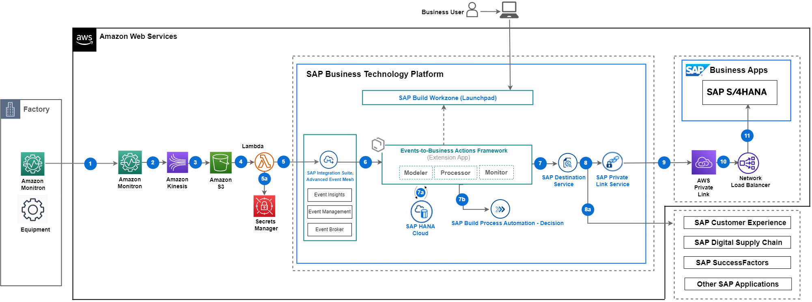

# Integration AWS Monitron with SAP BTP

This repository contains code samples and instructions for developing an extension application in SAP BTP. The sample application has been developed in a partner collaboration to help customers integrate any type of events from systems into SAP ecosystem via SAP BTP. This application helps to configure actions that needs to be taken in SAP LoB systems based on the events that is received in SAP Advanced Event Mesh. The application scenario you will develop in this tutorial leverages Event-To-Business actions framework (extension application).

This framework can be used in combination with any hyperscalar/telco IoT.

 In this tutorial, the **events** are received from **AWS Monitron** and the **actions** for these events are taken in **SAP S/4HANA**. You can use this application to further customize it for other systems as well.

 ## Table of Contents

[Scenario](#scenario)\
[Solution Architecture](#solution-architecture)\
[Implementation: Configuration and Development](#configuration-and-development)\
[Additional Resources](#additional-resources)\
[Known Issues](#known-issues)\
[Reference](#reference)\
[Disclaimer](#disclaimer)\
[How to Obtain Support](#how-to-obtain-support)\
[Code of Conduct](#codeofconduct)\
[Contributing](#contributing)\
[License](#license)

## Scenario

**Amazon Monitron** is an end-to-end system including hardware ( sensors and gateway) and software, that uses machine learning to detect abnormal conditions in industrial equipment and enable predictive maintenance. However, the output of machine learning in industrial operations only provides valuable results if action is taken on the machine learning insights. To reduce the burden of change management and ensure action is taken on the Monitron inferences, this sample project has demonstrated how to automatically record the Amazon Monitron inferences in SAP Plant maintenance/asset management.

## Solution Architecture

The key services used from **Amazon AWS** are Amazon Monitron, Amazon Kinesis, Amazon S3, Amazon Lambda Function, AWS Secrets Manager. The services used from **SAP BTP** are the Cloud Foundry Runtime, SAP Advanced Event Mesh, SAP Connectivity service, SAP Private Link service, SAP Workflow Management and SAP Destination service.

SAP Private Link service is used for connectivity between SAP BTP and SAP S/4HANA when both the systems are running on Amazon AWS Infrastructure, in this tutorial you will find implementation steps for SAP BTP Private Link service and AWS Private Link service. Alternatively you can use SAP Connectivity service and Cloud Connector for integration of SAP BTP and SAP S/4HANA as well.

 **Figure-1: High-level architecture (with SAP S/4HANA on AWS)**

The following steps depicts the information flow across systems:

(1) Event is triggered from Amazon Monitron Hardware and sent to Amazon Monitron Software.

(2) and (3) Amazon Kinesis streams the sensor data from Amazon Monitron and dumps it into the Amazon S3 bucket.

(4) AWS Lambda is a serverless function, which will orchestrate the process of detecting a stream contains any alerts related to failure or warnings, and then the inference result is passed to SAP Advanced Event Mesh.

(5a) AWS secrets manager is used to store credentials, these are used by the lambda function to provide payload to SAP Advanced Event Mesh.

(5) Event-to-Business-Action framework(extension app) processor module's endpoint is subscribed to SAP Advanced Event Mesh, hence receives this event.

(6) Event-to-Business-Action framework(extension app) processor module leverages the Business Rules capability of SAP Build Process Automation to derive business action (for example, In this scenario, Plant Maintenance Notification creation in SAP S/4HANA system) based on certain characteristics of incoming event.

(7), (8), (9) (10) and (11) Event-to-Business-Action framework (extension app) processor module triggers the defined action in the SAP S/4HANA system by using the SAP Destination Service and SAP Private Link Service.

For more information, see Set Up Connectivity Between SAP BTP and SAP S/4HANA Using SAP Private Link Service page.
