## Set Up the Subaccount in SAP BTP

### 1. Create or Use an Already Existing Subaccount in SAP BTP

You can use both trial and enterprise account in SAP BTP. To set up a trial account, see the [Get a Free Account on SAP BTP Trial](https://developers.sap.com/tutorials/hcp-create-trial-account.html) at SAP Tutorial Navigator.

You can use an existing subaccount or you can create a new one.

You need to have the Global Account Administrator role collection assigned to your user.

If you are new to SAP BTP, follow the [Get Ready to Develop on SAP BTP](https://developers.sap.com/group.scp-1-get-ready.html) tutorial at SAP Tutorial Navigator to get started with SAP BTP, create subaccounts. enable cloud foundry environment and assign entitlements.

1. Log in to SAP BTP cockpit, navigate to your global account and create a subaccount or use an existing one.
2. Choose **Cloud Foundry Environment** tab and then choose **Enable Cloud Foundry**.
3. Choose **Create Space** once the Cloud Foundry Environment is enabled.

4. Assign the following entitlements:

Service | Service Plan | Usage Scenario |
--- | --- | --- |
|[Authorization and Trust Management Service](https://discovery-center.cloud.sap/serviceCatalog/authorization-and-trust-management-service?region=all&tab=feature) | application | Manage application authorizations and connections to identity providers.|
|[Business Rules](https://help.sap.com/docs/BUSINESS_RULES) | standard | Digitize and automate decision making with business rules to increase flexibility and compliance.|
[Cloud Foundry Runtime](https://discovery-center.cloud.sap/serviceCatalog/cloud-foundry-runtime?region=all) | MEMORY | Create polyglot applications.The chosen quota defines the available amount of memory in GB.|
[SAP Connectivity Service](https://discovery-center.cloud.sap/serviceCatalog/connectivity-service?service_plan=lite&region=all&commercialModel=cloud) | lite | Establish connections between cloud applications and on-premise systems.|
[Destination Service](https://discovery-center.cloud.sap/serviceCatalog/destination?service_plan=lite&region=all&commercialModel=cloud) | lite | Destination service lets you find the destination information required to access a remote service or system from your extension application.|
[SAP Integration Suite,Advanced Event Mesh](https://discovery-center.cloud.sap/serviceCatalog/advanced-event-mesh?service_plan=default&region=all&commercialModel=cloud) | default | A complete event streaming, event management, and monitoring platform that incorporates best practices, expertise, and technology for event-driven architecture (EDA) on a single platform.|
[SAP Private Link Service](https://discovery-center.cloud.sap/serviceCatalog/private-link-service?service_plan=standard&region=all&commercialModel=cloud) | standard | Available only in Enterprise account. Establishes a private connection between selected SAP BTP services and selected services in your own IaaS provider accounts.|
[SAP Business Application Studio](https://discovery-center.cloud.sap/serviceCatalog/business-application-studio?region=all) | trial   standard-edition(Application) | Available in Trial as well as Enterprise account.
[SAP HANA Cloud](https://discovery-center.cloud.sap/serviceCatalog/sap-hana-cloud?tab=customerreference&region=all)  | hana | Application database for CAP Application
[SAP HANA Schemas & HDI Containers](https://help.sap.com/docs/SAP_HANA_PLATFORM/3823b0f33420468ba5f1cf7f59bd6bd9/e28abca91a004683845805efc2bf967c.html?version=2.0.04&locale=en-US) | hd-shared | Application database for CAP Application

**Note:** Service instances for Business Rules, SAP HANA Schemas & HDI Containers, Connectivity service, Destination service and SAP Authorization and Trust Management Service will be created programmatically during deployment. 

### 2. Set Up SAP Advanced Event Mesh

To set up SAP Advanced Event Mesh for this scenario, follow these steps:

1. In the SAP BTP cockpit, navigate to your subaccount and choose **Services** > **Service Marketplace** and then choose **SAP Integration Suite, Advanced Event Mesh.**.

    

2. Under **Application Plans** find the **default** application plan, choose the options menu on the right side of the row, and then choose **Create**

    

3. In the **New Instance or Subscription** dialog box, leave the prepopulated **Service** and **Plan** settings and choose **Next**.
    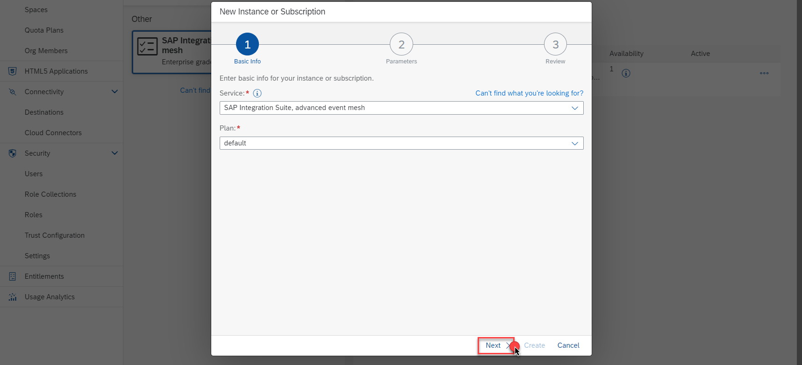
        

4. Add the email address for the user who is the subaccount administrator and then choose **Next**.
**Note** The user must be a valid user in the Identity Authentication tenant that has a trust configuration established with the subaccount. Refer to Managing Security Administrators in Your Subaccount.(https://help.sap.com/docs/btp/sap-business-technology-platform/managing-security-administrators-in-your-subaccount-fsa)

    

5. Review the details and choose **Create**.
    
    

6. To access the advanced event mesh, navigate to **Services** > and choose **Instances and Subscriptions**.
Choose the row for the advanced event mesh subscription and choose **Go to Application**

    

7. Choose **Cluster Manager** in the Advanced Event Mesh Application. 
    

8. Click on **Create Service**.
    
    Fill the **Service Name** as **Monitron** and select **Service Type** as **Standard**. Select **Amazon Web Services** from the drop down menu for **Cloud**, Choose **Frankfurt** as **Region** from the Map, leave the prepopulated version for **Broker Version** , for this tutorial.

    Click on **Create Service**

    

9. Click on the created service **Monitron**
    

    Click on the **connect** tab and expand the **REST** tile to get the messaging connectivity information.

    

10. Configuring a **REST Delivery Point**
     Next, you must configure a queue and a REST delivery point on Message VPN.

     **a.** Click on **Open Broker Manager**.

     

     **b.** The **Broker Manager** application loads. The next step is to create a queue, on the left pane click on **Queues**  
     

     **c.** Create a Queue by name **Q/rdp1/input**
     

     Enable both incoming and outgoing configuration
         

     Queue successfully created
         

     **d.** Add a **Topic Subscription** to the queue.

     Click on the queue created and then click on the **Subscriptions** Tab.

     Then click on **+ Subscription** to add a topic.
     

     In the **Create Subscription** screen, type in the topic name as **monitron/messages** and click **Create**
     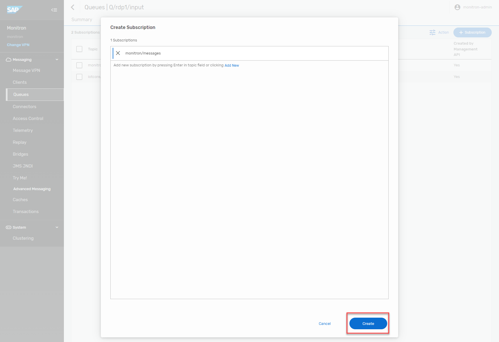    

     Topic Subscription successfully created. 
     

     **e.** Create a **REST Delivery Point** object

     On the left pane click on **Clients** and then Navigate to **REST** tab.
     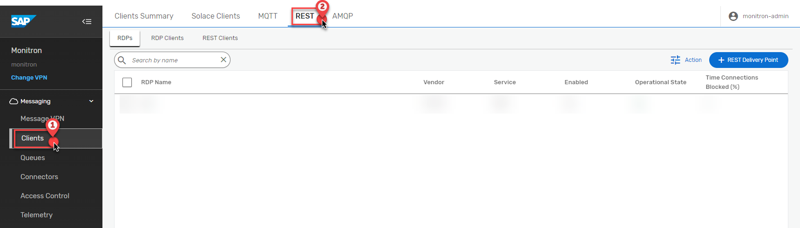

     Click on ** + REST Delivery Point** and Fill the **RDP Name** as **rdp1**
     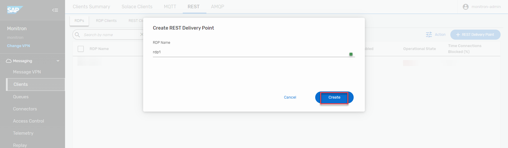

     Configure the REST Delivery Point
     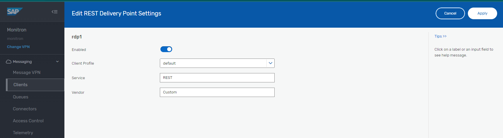  

     REST Delivery Point successfully created
     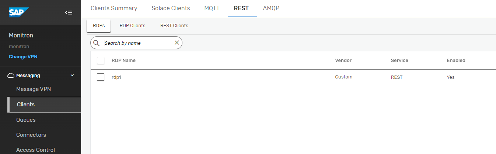  

     **f.**  Create a Queue Binding object

     Create a queue binding to the queue you created previously. This will tell the RDP where to fetch messages from. **Note:** that REST Delivery Points (RDPs) can be bound to multiple queues.

     Click on the **rdp1** created in the previous step. Click on **Queue Bindings** Tab.

     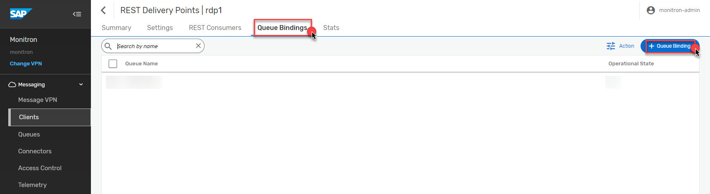

     Create a queue binding - **Q/rdp1/input**

     

     Set the POST target where the requests would be sent - **/api/events**

     

     **Note:** that the RDP is down - it will automatically start up when a REST consumer makes a connection to the RDP.

     

     **g.** Create a **REST Consumer** object.

     Navigate to **REST Consumers** Tab and click on **+ REST Conusmer**

     

     Fill in the **REST Consumer Name** as **rc1** 

     

     Enable the **REST Consumer** and set HOST:PORT details of the message HTTP listener. 

     To Fill the **Host** , Navigate to the Cloud Foundary Space where the application is deployed and Click on **action-management-srv**.

     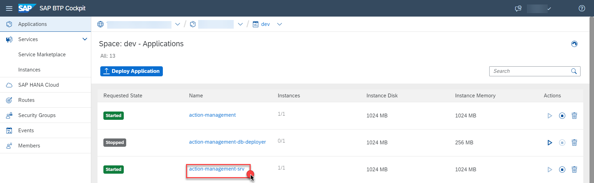

     Copy the link under **Application Routes**,. **Note:** Strip the **https://** before pasting the value in the **Host** field

     

     Fill in the Value of **Port** as **443**

     Select **POST** as the **HTTP Method**.

     Enable the TLS.

     Keep **Outgoing Connection Count** value as **1**.

     Fill the **Max Response Wait Time (sec)** as **30**

     Populate **Connection Retry Delay (sec)** field with **300**

     From the drop down menu, choose **OAuth 2.0 Client Credentials** as the **Authentication Scheme**.

     Next, Go to your **BTP subaccount** ,Navigate to **Services** > **Instances and Subscriptions** and under the **Instances** select **action-management-auth**.

     

     Under the **Service Keys** the key named **action-management-auth-key** is already created. Click on the **View** Option to get the **OAuth 2.0 Client Credentials**.  

     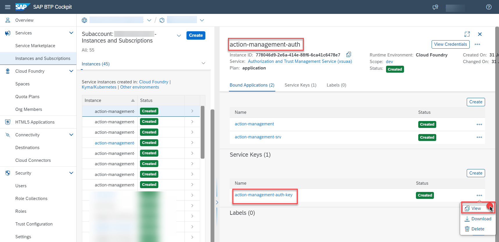

     Copy the **clientid**, **clientsecret** and **url**. Navigate back to the **REST Consumer** configuration and paste the values for **Client ID** and **Client Secret**. Paste the **url** copied earlier in the **Token Endpoint URL** and appened **/oauth/token** at the end of the **url**. 
     Effective **Token Endpoint URL** is **url/oauth/token**.

     Fill the remaining fields as shown in the screenshot below.

     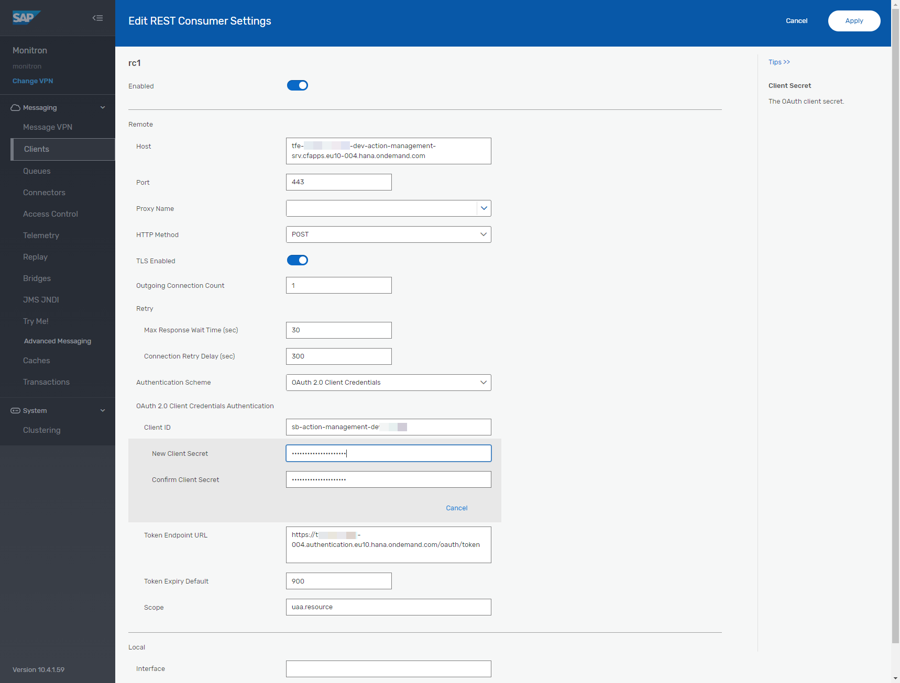  

     REST Consumer successfully created

       

     A final, configured **RDP settings** would look like this.

     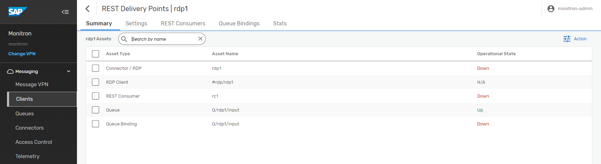

 

### 3. Set Up SAP HANA Cloud Instance

Refer [Deploy SAP HANA Cloud](https://developers.sap.com/tutorials/hana-cloud-deploying.html) to create an instance of SAP HANA Cloud in SAP BTP. 

If you already have an existing HANA Instance, you can map it to this SAP BTP subaccount.

### 4. Set Up SAP Business Application Studio

Refer [Manage Authorizations and Roles](https://help.sap.com/docs/SAP%20Business%20Application%20Studio/9d1db9835307451daa8c930fbd9ab264/01e69c53003c4b0a8a64310a3f08867d.html) to assign permissions to users.