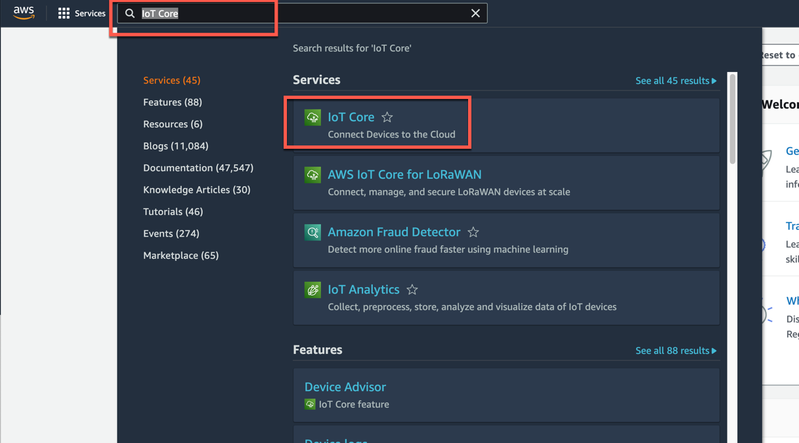

## Configure AWS 

In this tutorial, you will configure AWS components. These are the AWS services and components you will need for this scenario:

    - Valid AWS Subscription
    - AWS 
    - 
    - 

If you don't have access to a AWS (including a paid or trial subscription), create a new AWS account using [AWS Portal](https://aws.amazon.com/)

In this section, you will use Amazon AWS account to provision the resources needed for executing this workflow.

### 1. Create 

1. In the AWS portal, search for **Monitron** 
     
