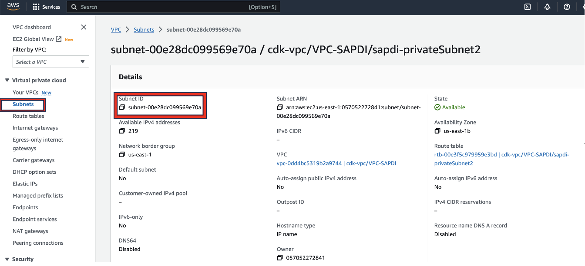
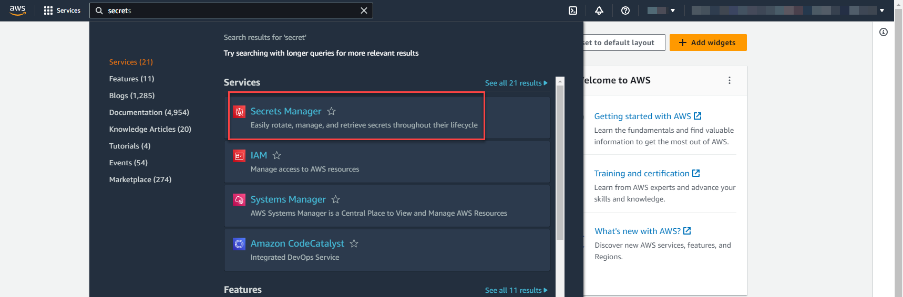
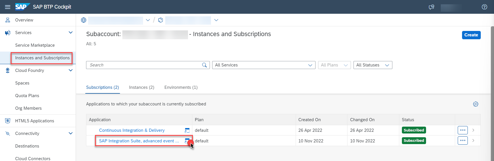

## Integrating Amazon Monitron and SAP Plant maintenance
Amazon Monitron is an end-to-end system including hardware ( sensors and gateway) and software, that uses machine learning to detect abnormal conditions in industrial equipment and enable predictive maintenance. However, the output of machine learning in industrial operations only provides valuable results if action is taken on the machine learning insights. To reduce the burden of change management and ensure action is taken on the Monitron inferences, this sample project has demonstrated how to automatically record the Amazon Monitron inferences in SAP Plant maintenance/asset management.
From an SAP standpoint, we are only looking for inference data from Monitron. Without the actual hardware set up, This can be done in 2 ways (S3 bucket is a pre-requisite)
1) Use the [payload](https://github.com/pra1veenk/aws-monitron-sap-integration/blob/main/documentation/Step5a-Setup-AWS/payload.json) file as a sample to integrate into SAP.
2) Use the [Kinesis data generator](https://awslabs.github.io/amazon-kinesis-data-generator/web/producer.html) and use the [template file](https://github.com/pra1veenk/aws-monitron-sap-integration/blob/main/documentation/Step5a-Setup-AWS/kinesisdatatemplate.json)  to simulate a kinesis stream.The sample [output file](https://github.com/pra1veenk/aws-monitron-sap-integration/blob/main/documentation/Step5a-Setup-AWS/kinesissample.txt) contains a seriesof json documents. Follow detailed steps provided in this [document](OptionalReadme.md).

## Architecture
  

## Deploying the CDK Project

This project is set up like a standard Python project.  For an integrated development environment (IDE), use `AWS Cloud9 environment` to create python virtual environment for the project with required dependencies.  

1. In the [AWS Console](https://us-east-1.console.aws.amazon.com/cloud9control/home?region=us-east-1#/product), navigate to **AWS Cloud9**. In AWS Cloud9 click **'Create New Environment'** > Select **'Instance type'** as **'t3.medium'** or **'t3.large'** and select platform as **'Amazon Linux 2'**. Under network settings, select the VPC and subnet created, for details on VPC creation follow this [tutorial](VPCReadme.md).
Click **Create**.


2.  Clone the github repository and navigate to the directory.

```
git clone https://github.com/aws-samples/aws-monitron-sap-integration.git

cd aws-monitron-sap-integration
```

To manually create a virtualenv 

```
python3 -m venv .env
```

After the init process completes and the virtualenv is created, you can use the following
step to activate your virtualenv.

```
source .env/bin/activate
```

Once the virtualenv is activated, you can install the required dependencies.

```
pip install -r requirements.txt
```

The `appConfig.json` file takes the input paramters for the stack. Maintain the following parameters in the `appConfig.json` before deploying the stack

## AWS environment details
* `account` Enter AWS account id of your AWS cloud environment
  Goto [AWS Console](https://us-east-1.console.aws.amazon.com/cloud9control/home?region=us-east-1#/product) and on the top right click on dropdown button as shown, Copy the Account ID as highlighted.
   
* `region`  Enter Region information where the stack resources needs to be created
  Goto [AWS Console](https://us-east-1.console.aws.amazon.com/cloud9control/home?region=us-east-1#/product) and on the top right click on dropdown as highlighted which shows the region, copy the region associated to your AWS Account(Example - us-east-1)
     
* `vpcId`   Enter the VPC for Lambda execution
  Goto [AWS Console](https://us-east-1.console.aws.amazon.com/cloud9control/home?region=us-east-1#/product) and type in "VPC" in the search tab->Click on VPC, you will see the list of all VPC's created in your AWS environment, select the VPC created as part of pre-requisite steps, Copy the vpcID as highlighted.
   
* `subnet`  Enter the subnet ID for Lambda exection
  Goto [AWS Console](https://us-east-1.console.aws.amazon.com/cloud9control/home?region=us-east-1#/product)and type in "Subnet" in the search tab->Click on Subnet, you will see the list of Subnet's created in your AWS environment, select the Private Subnet created as part of pre-requisite steps, Copy the SubnetID as highlighted below
*  Note: Please provide a private subnet for the lambda execution.
   
## Resource Identifiers
* `stackname` Enter an Identifier/Name for the CDK stack
* `ddbtablename` Enter a name for Dynamo DB Table that would be created as part of the stack which would hold the metadata for creating Service notification in SAP
## Bucket Structure
* `bucketname` Enter the name of the bucketwhere the inferences are sent.
* `inferencefolder` Enter the name of the folder(prefix)where the inferences are sent. Leave blank if no folder

## SAP Environnment details
The following are the two SAP Environment variables: 
* `SAP_AEM_CREDENTIALS` (example: arn:aws:secretsmanager://region/account/secret:sapemauth-pnyaRN)
* `SAP_AEM_REST_URL` (example: https://mr-connection-giuyy7qx0z1.messaging.solace.cloud:9443/topic)

The values for these variables needs to be stored in the **AWS Secrets Manager**. Go to your **AWS account** and search for **secret**, choose **Secrets Manager**



For Storing **SAP_AEM_CREDENTIALS** we need the Advanced Event Mesh UserName and Password. Open the Advanced Event Mesh Application from the BTP Cockpit. 



In the Application, Navigate to the Cluster Service **Monitron** created in **Step1** and Click on **Connect** Tab. 


Copy the **Username** and **Password**.  


Click on **Store a new secret**


Choose **Other type of secret** option under **Secret type**. Add two key-value pairs as **UserName and Password** and Paste the values copied from **Advanced Event Mesh Application**. Click on **Next**


Fill the **Secret name** as **sapaem-credentials** and Click on **Next**


Add your AWS credentials configuration as below to allow AWS Cloud9 environment to access your AWS account.
* export AWS_ACCESS_KEY_ID=""
* export AWS_SECRET_ACCESS_KEY=“”
* export AWS_SESSION_TOKEN=“”
* export AWS_DEFAULT_REGION=“”

Bootstrap your AWS account for CDK. Please check [here](https://docs.aws.amazon.com/cdk/latest/guide/tools.html) for more details on bootstraping for CDK. Bootstraping deploys a CDK toolkit stack to your account and creates a S3 bucket for storing various artifacts. You incur any charges for what the AWS CDK stores in the bucket. Because the AWS CDK does not remove any objects from the bucket, the bucket can accumulate objects as you use the AWS CDK. You can get rid of the bucket by deleting the CDKToolkit stack from your account.

```
cdk bootstrap aws://<YOUR ACCOUNT ID>/<YOUR AWS REGION>
```

Deploy the stack to your account. Make sure your CLI is setup for account ID and region provided in the appConfig.json file.

```
cdk deploy
```
## Cleanup

In order to delete all resources created by this CDK app, follow steps outlined in this [document](CleanupReadme.md)


## Useful commands

 * `cdk ls`          list all stacks in the app
 * `cdk synth`       emits the synthesized CloudFormation template
 * `cdk deploy`      deploy this stack to your default AWS account/region
 * `cdk diff`        compare deployed stack with current state
 * `cdk docs`        open CDK documentation
