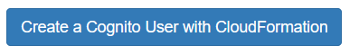
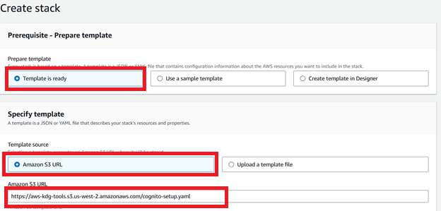
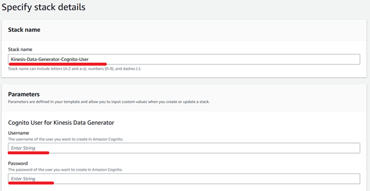
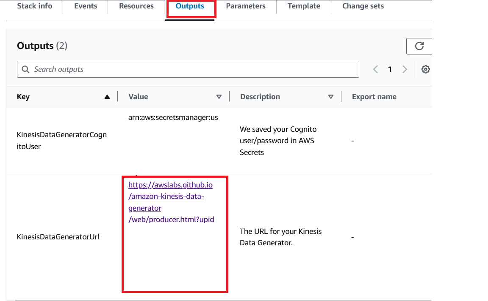
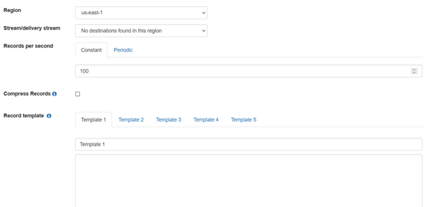
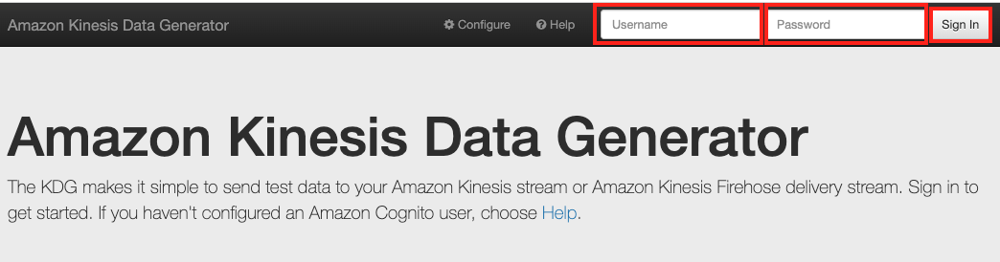
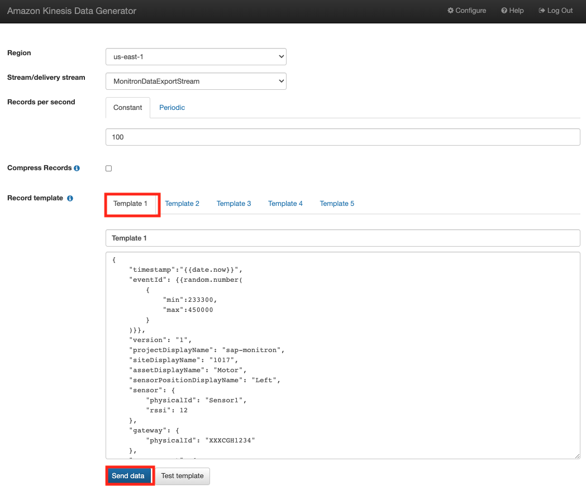
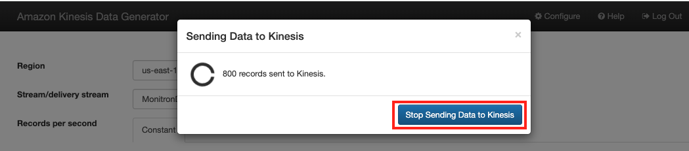
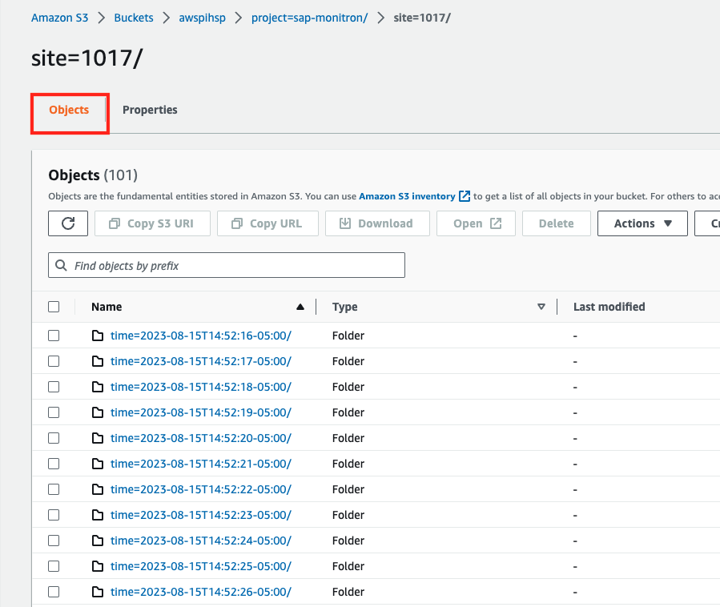
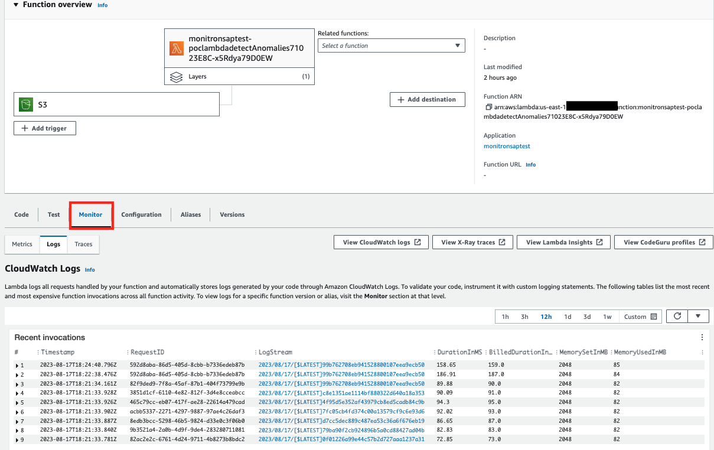

## Integrating Amazon Monitron and SAP Plant maintenance
Amazon Monitron is an end-to-end system including hardware ( sensors and gateway) and software, that uses machine learning to detect abnormal conditions in industrial equipment and enable predictive maintenance. However, the output of machine learning in industrial operations only provides valuable results if action is taken on the machine learning insights. To reduce the burden of change management and ensure action is taken on the Monitron inferences, this sample project has demonstrated how to automatically record the Amazon Monitron inferences in SAP Plant maintenance/asset management.
From an SAP standpoint, we are only looking for inference data from Monitron. Without the actual hardware set up, This can be done in 2 ways (S3 bucket is a pre-requisite)
1) Use the [payload](/payload.json) file as a sample to integrate into SAP.
2) Use the [Kinesis data generator](https://awslabs.github.io/amazon-kinesis-data-generator/web/producer.html) and use the [template file](/kinesisdatatemplate.json)  to simulate a kinesis stream.The sample [output file](/kinesissample.txt) contains a seriesof json documents.


## (Optional)Kinesis Data Generator ( Monitron Simulator)
This step is optional if you intend not to use the payload file as a sample to integrate into SAP.
Before generating data, please complete the following steps
1) Create an S3 bucket
2) Create a kinesis data generator
Getting started with the Kinesis Data Generator requires only three steps:
* Create an Amazon Cognito user in your AWS account (first-time only). (Prior to CDK deploy)
* Login to Kinesis Data Generator. ( After CDK deploy)
* Create a record template for your data.(After CDK deploy)

**Step 1: Create an Amazon Cognito user in your AWS account**

* Click [link](https://awslabs.github.io/amazon-kinesis-data-generator/web/help.html#configAccount) which will provide details on Amazon Lambda function and Amazon CloudFormation template to create the user and assign permissions to use the Kinesis Data Generator.In the link provided above, Navigate to **create a Cognito user with CloudFormation**
  
* Use default selections as below
  
   

  Ensure the region in the top right corner is set to the same region as your Cloud9 environment. Click **Next**
* Provide Username and Password and click **Next**

   

* Leave the selections as default and Click **Next** 
Check the box indicating acknowledgement on the IAM resources: **“I acknowledge that AWS CloudFormation might create IAM resources.”**
Click **Submit**
Once the CloudFormation stack is in **CREATE_COMPLETE**, you can validate the resources created in the **“Resources”** tab. Navigate to the **“Outputs”** tab and copy the URL specified in **KinesisDataGeneratorUrl**. This is your URL to login to Kinesis Data Generator in **Step 2** after the CDK is deployed.

  

## Deploying the CDK Project

This project is set up like a standard Python project.  For an integrated development environment (IDE), use `AWS Cloud9 environment` to create python virtual environment for the project with required dependencies.  

1. In the AWS Console, navigate to **AWS Cloud9**. In AWS Cloud9 click **'Create New Environment'** > Select **'Instance type'** as **'t3.medium'** or **'t3.large'** and select platform as **'Amazon Linux 2'**. 
Under **Network settings**, expand **VPC settings** and select the VPC created as part of pre-requisite. In **'Subnet'**, select the **'Private subnet'** (do not select the public subnet to deploy the resources). This will ensure the Lambda function is not deployed in a public subnet.  

Leave other configurations as default and click **Create**.


2.  Clone the github repository and navigate to the directory.

```
git clone https://github.com/aws-samples/aws-monitron-sap-integration.git

cd aws-monitron-sap-integration
```

To manually create a virtualenv 

```
python3 -m venv .env
```

After the init process completes and the virtualenv is created, you can use the following
step to activate your virtualenv.

```
source .env/bin/activate
```

Once the virtualenv is activated, you can install the required dependencies.

```
pip install -r requirements.txt
```

The `appConfig.json` file takes the input paramters for the stack. Maintain the following parameters in the `appConfig.json` before deploying the stack

## AWS environment details
* `account` Enter AWS account id of your AWS cloud environment
* `region`  Enter Region information where the stack resources needs to be created
* `vpcId`   Enter the VPC for Lambda execution from where Lambda can access SAP resources and look out for vision
* `subnet`  Enter the subnet for Lambda exection
## Resource Identifiers
* `stackname` Enter an Identifier/Name for the CDK stack
* `ddbtablename` Enter a name for Dynamo DB Table that would be created as part of the stack which would hold the metadata for creating Service notification in SAP
## Bucket Structure
* `bucketname` Enter the name of the bucketwhere the inferences are sent.
* `inferencefolder` Enter the name of the folder(prefix)where the inferences are sent. Leave blank if no folder
## SAP Environnment details
* `SAP_EM_OAUTH_SECRET` (example: arn:aws:secretsmanager://region/account/secret:sapemauth-pnyaRN)
* `SAP_EM_OAUTH_URL` (example: https://<host>.authentication.<region>.hana.ondemand.com/oauth/token)
* `SAP_EM_OAUTH_CLIENT_ID` 
* `SAP_EM_REST_URL` (example: https://enterprise-messaging-pubsub.<host>.<region>/messagingrest/v1/topics/<>)

Add your AWS credentials configuration as below to allow AWS Cloud9 environment to access your AWS account.
export AWS_ACCESS_KEY_ID=""
export AWS_SECRET_ACCESS_KEY=“”
export AWS_SESSION_TOKEN=“”
export AWS_DEFAULT_REGION=“”

Bootstrap your AWS account for CDK. Please check [here](https://docs.aws.amazon.com/cdk/latest/guide/tools.html) for more details on bootstraping for CDK. Bootstraping deploys a CDK toolkit stack to your account and creates a S3 bucket for storing various artifacts. You incur any charges for what the AWS CDK stores in the bucket. Because the AWS CDK does not remove any objects from the bucket, the bucket can accumulate objects as you use the AWS CDK. You can get rid of the bucket by deleting the CDKToolkit stack from your account.

```
cdk bootstrap aws://<YOUR ACCOUNT ID>/<YOUR AWS REGION>
```

Deploy the stack to your account. Make sure your CLI is setup for account ID and region provided in the appConfig.json file.

```
cdk deploy
```
## (Optional)Kinesis Data Generator ( Monitron Simulator)

Follow these steps only if you have setup Kinesis Data Generator and followed previous steps to create an Amazon Cognito user and have deployed the CDK as above. 
**Step 2**:**log in to Kinesis Data Generator**.
Use the credentials created in **Step 1** along with the URL specified in outputs tab to login to Kinesis Data Generator. 
Note: If the access URL is not used from the CloudFormation stack, the KDG login will return errors asking for user pool and other information. 
Once you provide the credentials, as specified, you will reach the landing page:
 

**Step 3**:**Create a record template for your data**.
Generate data using the following steps:
** Launch [Kinesis Data Generator](https://awslabs.github.io/amazon-kinesis-data-generator/web/producer.html), Enter **Username** > **Password** and click **Sign In**

 

 **Select **‘Region’** , Select Kinesis Stream created for streaming Amazon Monitron data **‘MonitronDataExportStream’**, 
   Enter the [template file](https://github.com/pra1veenk/aws-monitron-sap-integration/blob/main/Code/AWS/kinesisdatatemplate.json) in section **‘Record template→ Template 1’**  to generate the streaming data and Click **Send Data**.

 

 **Click **Stop Sending Data to Kinesis** 

  

 ** **Data Validation** 
 Validate the data streaming to Amazon S3 using the steps below:
    ** Goto **AWS Console** Select **Amazon S3**Select **Amazon S3 bucket** and Click **Objects** to view the streaming data files

   

 Validate if the AWS Lambda Function is invoked using the following steps , 
     ** Goto **AWS Console** Select **AWS Lambda** - **Click on AWS Lambda Function created for anomaly detection** - ** Click **Monitor** tab to view the invocation.
  
  
## Cleanup

In order to delete all resources created by this CDK app, run the following command

```
cdk destroy
```

## Useful commands

 * `cdk ls`          list all stacks in the app
 * `cdk synth`       emits the synthesized CloudFormation template
 * `cdk deploy`      deploy this stack to your default AWS account/region
 * `cdk diff`        compare deployed stack with current state
 * `cdk docs`        open CDK documentation
